# ND Kotak Neo TBS (Time-Based Selling) Strategy Architecture & Implementation Manual

---

# Part A: Strategy Architecture & Technical Implementation

## 1. Strategy Lifecycle Flow Chart

```mermaid
flowchart TD
    subgraph S1["1. Initialization & Scheduling"]
        A["User Configures Strategy<br/>(Entry Time, Exit Time, Strikes, SL, Target, Trailing)"] --> B["Strategy Deployed (Status: Deployed)"]
        B --> C{"Check IST Time vs Entry Time"}
        C -- "Now < (Entry Time - 20s)" --> C
    end

    subgraph S2["2. High-Speed Pre-Warmup (T-20s)"]
        C -- "Now >= (Entry Time - 20s)" --> D["Trigger T-20s Warmup Phase"]
        D --> E["Query Live Spot Rates (NSE CM / BSE CM)"]
        E --> F["Resolve Strikes: ATM / Offset / Closest Premium"]
        F --> G["Subscribe Candidate Option Tokens to WebSocket Feed"]
        G --> H["Stage Prepared Legs in Memory"]
    end

    subgraph S3["3. Firing Execution (T-00s)"]
        H --> I{"Now >= Entry Time?"}
        I -- No --> I
        I -- Yes --> J["Instant Entry Firing (0ms Latency Overhead)"]
        J --> K["Calculate Entry Limit Price = LTP ± Market Protection (MP)"]
        K --> L["Place Entry Order (Broker Limit Order)"]
        L --> M["Poll Execution Status (get_order_execution_details)"]
        M --> N{"Is Entry Executed & Filled?"}
        N -- "Rejected / Failed" --> O["Log Rejection & Abort Leg / Strategy"]
        N -- "Filled" --> P["Capture Actual Execution Average Price"]
    end

    subgraph S4["4. Bracket Protection Setup"]
        P --> Q["Place Broker-Side Stop Loss Limit Order (order_type='SL')"]
        Q --> R["Set SL Price = Entry Price ± Configured SL Buffer (Rounded to 0.05)"]
        R --> S["Place/Simulate Target Order (Limit Order)"]
        S --> T["Activate Deployment State & Live Monitoring"]
    end

    subgraph S5["5. Live Position Monitoring Loop (1 Hz)"]
        T --> U["Receive Real-Time WebSocket Ticks (ltp_cache)"]
        U --> V["Calculate Live PnL & Leg Metrics"]
        V --> W{"Trailing SL Condition Met?"}
        W -- Yes --> X["Call client.modify_order() to Trail Broker SL"]
        W -- No --> Y{"Reconciliation Check"}
        
        X --> Y
        Y --> Z1{"SL Order Filled on Exchange?"}
        Z1 -- Yes --> EA["Mark SL Hit -> Cancel Target (OCO) -> Complete Leg"]
        Z1 -- No --> Z2{"Net Position Confirmed 0 (3 consecutive checks)?"}
        Z2 -- Yes --> EB["External Exit Confirmed -> Cancel Pending Orders -> Complete"]
        Z2 -- No --> Z3{"Target Reached or Exit Time Met?"}
        Z3 -- Yes --> EC["Place Market Protection Exit Order -> Cancel SL (OCO) -> Complete"]
        Z3 -- No --> U
    end

    subgraph S6["6. Completion"]
        EA --> FIN["Strategy Completed & Saved"]
        EB --> FIN
        EC --> FIN
    end
```



---

## 2. Technical Implementation Details

### A. Pre-Warmup Pipeline (`T-20s`)
* **Problem Solved**: Options master lookups, HTTP network roundtrips for spot index values, and closest premium calculations take 800ms–2500ms. Firing precisely at 09:20:00 would result in orders reaching the exchange at 09:20:02.
* **Mechanism**: At $T - 20\text{s}$ before `entry_time`, the system initiates warmup:
  1. Resolves dynamic expiries (`CURRENT_WEEK`, `NEXT_WEEK`, `MONTH_END`).
  2. Pulls spot price from live WebSocket feed or fast CM quotes.
  3. Evaluates strike criteria:
     - **Strike Type**: ATM strike derived via `round(ref_price / 50.0) * 50`, plus/minus offsets for OTM/ITM.
     - **Closest Premium**: Queries top 30 candidate contracts and matches live quotes to the target premium.
  4. Automatically registers option tokens into `subscription_queue` for WebSocket streaming.
  5. Stages the order payload in memory so that at $T = 00\text{s}$, execution happens instantly.

### B. Execution Engine & Market Protection (`apply_market_protection`)
* **Order Type**: Pure `MKT` orders are risky in F&O options due to illiquidity and exchange fat-finger checks.
* **Market Protection (MP)**: Converts the trade into a buffered Limit Order:
  $$\text{Buy Limit} = \text{LTP} \times (1 + \text{MP}\%) \quad|\quad \text{Sell Limit} = \text{LTP} \times (1 - \text{MP}\%)$$
* **Tick Size Enforcement**: Strictly rounded to NSE 0.05 ticks:
  ```python
  limit_price = round(round(calculated_price / 0.05) * 0.05, 2)
  ```

### C. Broker-Side Protective Stop Loss
* **Clean SL Limit Orders**: Immediately following entry fill confirmation, TBS places real broker-level SL orders (`order_type="SL"`):
  - `trigger_price`: Trigger price rounded to 0.05 tick.
  - `price`: Limit price matches trigger price (no wide artificial slippage distortion).
  - Exchange: `nse_fo`, Product: `NRML` or `MIS`.

### D. WebSocket Streaming & Live PnL
* Runs on a background thread utilizing Kotak Neo's async `SFeed` WebSocket protocol.
* Real-time packet parsing updates `ltp_cache[token]`.
* Strategy monitoring loop computes:
  $$\text{Leg PnL} = (\text{Current LTP} - \text{Entry Price}) \times \text{Quantity} \times (\text{-1 if Sell else +1})$$

### E. OCO (One-Cancels-the-Other) & Reconciliation Safety
* **Exchange Fill Detection**: Polls broker execution reports. If the exchange executes the Stop Loss, TBS recognizes the fill price and cancels any counter target orders.
* **External Exit Reconciliation**: Queries `client.positions()` using a multi-field matcher (`trdSym`, `dispSym`, `token`). If a trader manually squares off positions from their phone, TBS confirms this over 3 consecutive cycles, prevents double square-offs, and auto-cancels pending SL orders.

---

# Part B: Code Review Mechanism & Skill Development

## 1. Code Review Mechanism (Production Trading Checklist)

When building or modifying algorithmic execution engines for Indian markets, every pull request / modification must pass this 6-point verification gate:

| # | Inspection Category | What to Verify | Failure Mode if Missed |
|---|---------------------|----------------|------------------------|
| **1** | **Timezone Strictness** | All clock comparisons must use `Asia/Kolkata` (`IST_TZ`), never local machine time or naive UTC. | Orders trigger early/late or date roll checks fail during VPS deployments. |
| **2** | **Tick Size Compliance** | Any order price (`limit`, `trigger`, `sl`) must be clamped to $0.05$ NSE tick sizes. | Broker/Exchange RMS rejection: `10300 - Invalid Price Tick`. |
| **3** | **State Absence vs. Value Zero** | A missing entry or failed API call must return `None` (unknown), **never** `0`. | Broker reporting glitch causes strategy to think position was closed externally, prematurely cancelling SLs. |
| **4** | **Reconciliation Debounce** | External actions (manual exits, SL triggers) must have a multi-check confirmation buffer (e.g. $\ge 3$ cycles). | Transient network dropped packet terminates an active strategy mid-trade. |
| **5** | **Pre-Flight Broker Checks** | Before submitting any square-off / exit order, verify net open broker quantity. | Double square-off: Accidentally opens an opposite speculative naked position! |
| **6** | **Session Date Tagging** | Authenticated credentials must record `login_date`. Real orders must be blocked if login date $\neq$ today. | API session expires silently overnight; morning execution fails catastrophically. |

---

## 2. Skill Development: Lessons Learned for Live Implementation

From our journey developing and debugging ND Kotak Neo TBS, the following key engineering rules have been synthesized:

### Lesson 1: Broker APIs Differ Between Documentation and Wire Reality
* **Observation**: Kotak Neo returns different JSON keys across order reports, positions, and quotes. For example, `positions()` might encapsulate data inside `dict["data"]`, `dict["data"]["data"]`, or `dict["result"]`. Furthermore, contract names vary between `pTrdSymbol` (`NIFTY26O1323550CE`) and terminal displays (`NIFTY 23550 CALL 13 OCT`).
* **Rule**: Write **poly-morphic payload extractors** that check multiple candidate keys (`trdSym`, `tradingSymbol`, `sym`, `dispSym`, `tok`) and strip formatting (spaces/hyphens) before matching.

### Lesson 2: Never Trust Order Placement Response as Order Fill
* **Observation**: An order placement returning `status: 200` and an `nOrdNo` only means the broker accepted the request. It does **not** mean it traded on the exchange.
* **Rule**: Always poll `order_report` / `order_history` with exponential backoff to confirm `complete` or `traded` status and extract the actual weighted `avg_price` before arming SL/TP orders.

### Lesson 3: Separate Order Placement from Background Monitoring
* **Observation**: If a monitoring loop blocks synchronously on an HTTP call or sleep, tick processing freezes and trailing SL stops responding.
* **Rule**: Decouple incoming WebSocket ticks (in-memory cache) from strategy evaluation loops, and ensure all broker REST queries in the loop use non-blocking timeouts (`timeout=2.0s`).

### Lesson 4: Fail Safe, Never Fail Open
* **Observation**: If an API exception occurs while checking broker status, raising an error or returning `0` leads to destructive cascade actions (such as dropping stop loss orders).
* **Rule**: In algorithmic finance, an unknown state must default to **hold and alert** (`return None`), keeping active safety orders in the market until verified.

### Lesson 5: Persistent Daily File Logging & One-Click Remote Downloads
* **Observation**: On headless remote production cloud servers (e.g. AWS EC2), in-memory logs are lost on restarts, and SSH terminal scrolling is tedious and error-prone during live market hours.
* **Rule**: Maintain both a rotating in-memory buffer (for real-time web streaming) and automated **daily disk append files** (`tbs_app_YYYY-MM-DD.log`). Provide a one-click frontend download endpoint (`/api/logs/download`) so users can export timestamped diagnostic logs directly from their browser anytime.

